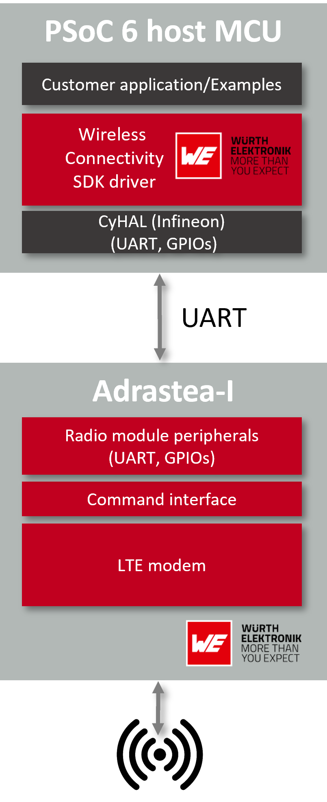
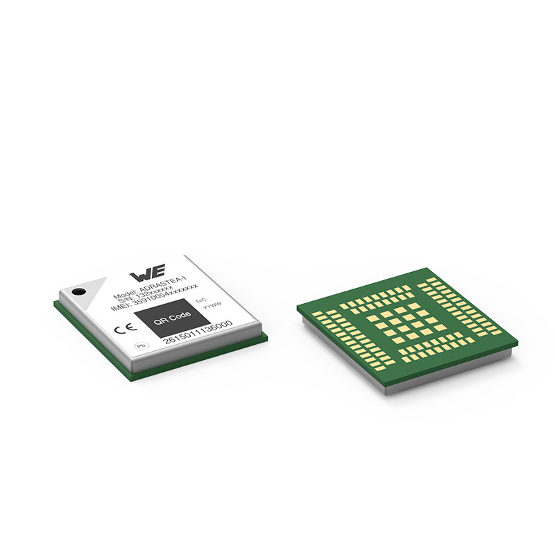
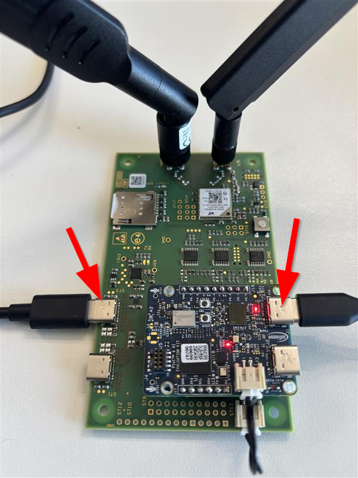
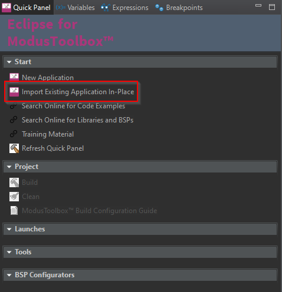
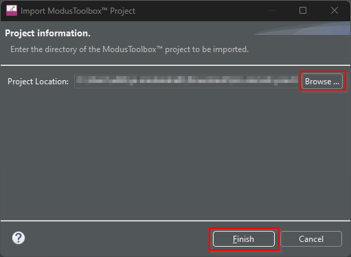
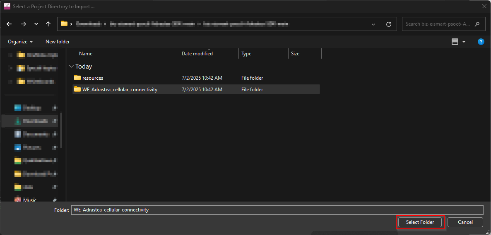
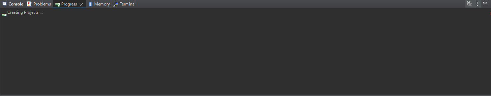
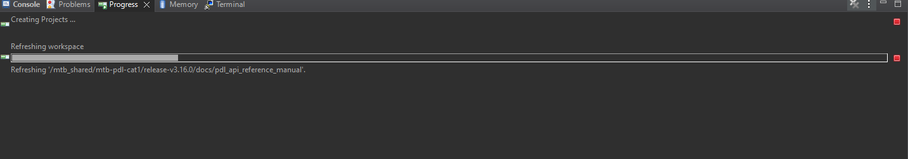
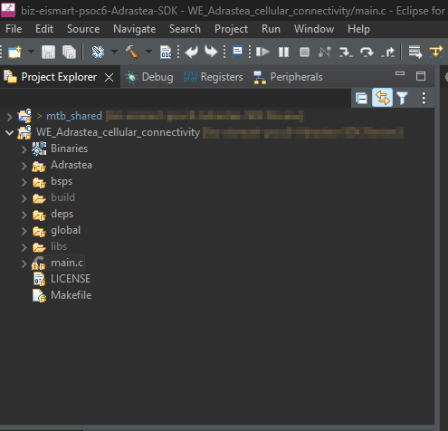
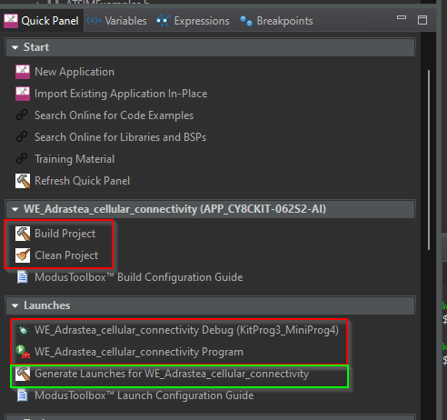

# Wireless connectivity SDK for PSoC™ 6 platform

To ease the integration of the radio modules into an embedded application Würth Electronic eiSos offers the corresponding Software Development Kit for most commonly used host processors. This specific SDK contains drivers, commands and examples in C-code to integrate the [wireless connectivity modules](https://www.we-online.com/wcs) from Würth Elektronik with the PSoC™ 6 MCU family of devices from Infineon.

Supported WE radio modules.
- Adrastea-I

## Quick Links

- [Introduction](#introduction)
- [Adrastea-I cellular module](#adrastea-i-cellular-module)
- [PSoC™ 6 MCU](#psoc-6-mcu-family)
- [Getting started](#getting-started)
- [Prerequisites](#requirements)
- [Hardware setup](#hardware-setup)
- [Software setup](#software-setup)
- [Running the examples](#running-the-examples)
- [Adrastea-I examples](#adrastea-examples)
- [Related resources](#related-resources)
- [Other resources](#other-resources)

## Introduction

The Würth Elektronik eiSos wireless modules provide an easy to use radio interface to any embedded application. The host processor of the embedded application can operate the module by sending commands via UART to the module’s command interface.

The Wireless Connectivity SDK is a set of software tools that enable quick software integration
of Würth Elektronik eiSos wireless modules into external host processors. It consists of examples and platform independent module drivers in C-code that use the UART to communicate
with the attached radio device.

The Adrastea-I Wireless Connectivity SDK has been developed and tested on the PSoC™ 6 platform, but is designed in a way that it can be easily ported to any other host processor platform. The
C-code of examples, command interface definition and platform dependent functions are separated from each other.




## Adrastea-I Cellular module

[Adrastea-I]((https://www.we-online.com/en/components/products/ADRASTEA-I) ) module is a compact LTE-M/NB-IoT cellular module with integrated GNSS and integrated ARM Cortex-M4 with 1MB flash memory for simple custom applications, similar to the use-cases and applications showcased in the following chapters. Based on the Sony Altair ALT1250 chipset, the Adrastea-I module provides AT-Command based multi-band configurability, enabling international multi-regional coverage in LTE Cat M1/NB1 radio access technologies. Adrastea-I includes a fully integrated global navigation satellite system solution that supports GPS and GLONASS positioning systems.

Compact 13.4 mm x 14.6 mm x 1.85 mm design allows the module to fit in small-size applications. The module can be operated through one of two available cellular communication technologies:

- LTE-Cat.M or
- LTE-Cat.NB-IoT.
The module comes with the declaration of conformity (CE) and is compliant to RoHS, REACh. The Adrastea-I cellular radio module is GCF and Deutsche Telekom certified.

Further details about the Adrastea-I radio module can be found under [we-online.de/katalog/en/Adrastea-I](we-online.de/katalog/en/Adrastea-I).



## PSoC™ 6 MCU family

PSoC™ 6 MCU family of devices are a single chip solution for the emerging IoT devices. PSoC™ 6 MCU bridges the gap between expensive, power hungry application processors and low‑performance microcontrollers (MCUs). The ultra‑low‑power, dual-core architecture of PSoC™ 6 MCU offers the processing performance needed by IoT devices, eliminating the tradeoffs between power and performance.

Visit the [PSoC™ 6](https://www.infineon.com/cms/en/product/microcontroller/32-bit-psoc-arm-cortex-microcontroller/psoc-6-32-bit-arm-cortex-m4-mcu/) MCU webpage to explore more about PSoC™ 6 MCU family of device.

## Getting Started

This SDK provides simple examples to evaluate several features of the Adrastea-I cellular module with PSoC™ 6 Artificial Intelligence Evaluation Kit [(CY8CKIT-062S2-AI)](https://www.infineon.com/cms/en/product/evaluation-boards/cy8ckit-062s2-ai/).


## Requirements

- [ModusToolbox&trade;](https://www.infineon.com/modustoolbox) v3.2 or later (tested with v3.5)
- Board support package (BSP) minimum required version for :
   - PSoC&trade; 6 MCU: v4.0.0
   - KIT_XMC72_EVK: v1.0.0
   - CYW920829M2EVK-02: v1.0.1
   - CYW989829M2EVB-01: v1.0.1
- Programming language: C
- IDE Eclipse for ModusToolbox&trade;

## Hardware setup

For the examples in this SDK, we use the pins on the Expansion I/O header (J17) to interface with the Adrastea-I radio module. The following pins are used,

Pin number J17 | MCU pin number | Function |  
---------------|----------------|----------|
1 | P9_0 | MCU UART RX connect to UART TX of Adrastea (Pin 21)|
2 | P9_1 | MCU UART TX connect to UART RX of Adrastea (Pin 22)|
3 | P9_2 | [Optional] MCU UART RTS connect to UART CTS of Adrastea (Pin 20) |
4 | P9_3 | [Optional] MCU UART CTS connect to UART RTS of Adrastea (Pin 19) |
5 | P9_4 | [Optional] Connect to status indication pin of Adrastea (Pin 58)|
6 | P9_5 | Connect to /RESET pin of Adrastea (Pin 9)|
7 | P9_6 | Connect to WAKEUP pin of Adrastea (Pin 7)|
8 | NC | NC|
9 | GND | GND|

> [!WARNING] 
> The Adrastea-I cellular module works with 1.8V digital logic and the CY8CKIT-062S2-AI EV board with 3.3V logic. Please make sure to implement the corresponding voltage conversion logic when using without the correct adapter board.

The Adapter board designed by [MEDS](www.meds.at) in collaboration with [Infineon](https://www.infineon.com/c) and [Würth Elektronik eiSos](https://www.we-online.com/) offers a plug-and-play hardware solution to integration the CY8CKIT-062S2-AI with the Adrastea-I module. This board implements the necessary voltage conversion between the boards and offers all the necessary interface including a microSIM interface and RF connectors for LTE and GNSS.

Get in touch us via e-mail, [**wcs@we-online.com**](mailto:wcs@we-online.com) or your local sales contact to get the necessary hardware.


## Software setup

This SDK supports development of software application on the PSoC&trade; platform using the ModusToolbox&trade; from Infineon.

Follow the [ModusToolbox™ software installation guide](https://www.infineon.com/dgdl/Infineon-ModusToolbox-software-installation-guide-GettingStarted-v67_00-EN.pdf) to install all the necessary tools.

[Optional] If you intend to use VS code follow the instructions from the [Visual Studio Code for ModusToolbox™ user guide.](https://www.infineon.com/dgdl/Infineon-Visual-Studio-Code-user-guide-UserManual-v08_00-EN.pdf?fileId=8ac78c8c92416ca50192787be52923b2)

## Running the examples

**Step 1**:  Insert an active micro SIM that supports NB-IoT or LTE-M. and connect the antennas to the adapter board.


**Step 2**: Power up the Adrastea-I board via ST3 and the connect the KP3-USB port of the CY8CKIT-062S2-AI kit to your PC for flashing/debugging.



**Step 3**: Clone this repository to a location of your choose. Open Eclipse for ModusToolbox&trade; and choose the root directory of this repository as your workspace.

> [!WARNING] 
> Make sure that the repository is located in a path whose length is as short as possible. Make sure that the longest path length including the sub-directories does not exceed 260 characters(MAX_PATH_LENGTH in windows).

**Step 4**: Use the "Import Existing Application In-place" option and in the import wizard, click on "Browse". In the file explorer pop-up browse to the location with this repository and select the folder "WE_Adrastea_cellular_connectivity" and click on "Finish". This will trigger setting up of the project and may take a few minutes. You can check the progress in the "Progress" Window. Once completed, you should be able to view two projects in the "Project Explorer" window.

- mtb_shared
- WE_Adrastea_cellular_Connectivity













**Step 5**: Open the file "Adrastea -> AdrasteaI_Examples.c" and the select the example you want to run by uncommenting one of the options available in the function "AdrasteaI_Examples()"

```C
void AdrasteaI_Examples()
{
void AdrasteaI_Examples()
{
    AdrasteaI_uart.baudrate = 115200;
    AdrasteaI_uart.flowControl = WE_FlowControl_NoFlowControl;
    AdrasteaI_uart.parity = WE_Parity_None;
    AdrasteaI_uart.uartInit = WE_UART1_Init;
    AdrasteaI_uart.uartDeinit = WE_UART1_DeInit;
    AdrasteaI_uart.uartTransmit = WE_UART1_Transmit;
	
	/*Select one example to run by uncommenting the same. All the other examples should remain commented */
    //ATDeviceExample();
    //ATPowerExample();
    //ATNetServiceExample();
    //ATHTTPExample();
    //ATGNSSExample();
    //ATSIMExample();
    ATMQTTExample();
    return;
}
}

```

**Step 6**: Use the options in the "Quick Panel" to Clean/Build and finally debug/program the example. If the options to debug and/or program does not exist, click on "Generate Launches for WE_Adrastea_cellular_connectivity" to create the launches. The examples generate debug logs on the default debug port.



## Adrastea examples

This SDK implements the following set of examples to enable comprehensive evaluation of the feature set offered by the Adrastea cellular module.

- Device example: This examples implements a set of device related commands such as reading out the IMEI number, manufacturer identity, device identity, serial number and similar parameters.

- Power example: This example demonstrates the low power mode of the module

- Net service example: This example implements all the features necessary to interact with the cellular network. For example, scan for available networks, read the signal strength etc.

- HTTP example: This example demonstrates the HTTP client capabilities by connecting to a demo HTTP server and performing a GET operation.

- GNSS example: GNSS example configures the Adrastea-I module in the appropriate mode and performs a fix.

- SIM example: Implements the utilities need to interact with a SIM.

- MQTT example: The MQTT example (enabled by default), demonstrates the MQTT client functionality of the Adrastea-I module. In this example, the MQTT client is configure to connect to the [A1 IoT platform](https://www.a1.digital/iot/).

> [!Note] 
> In order to run this example, you will need an A1 IoT platform account.

Configure the following parameters in the file ["ATMQTTExamples.c"](\WE_Adrastea_cellular_connectivity\Adrastea\ATMQTTExamples.c) before running this example.
1. Address of your A1 cloud instance.
2. Username for MQTT authorization this is a combination of the tenant ID and the username used for logging into to the platform.
3. Password for MQTT authentication is the same password used for logging into to the platform

```C
AdrasteaI_ATCommon_IP_Addr_t A1ServerAddress = "avl.iotstg.a1.digital";
AdrasteaI_ATCommon_Auth_Username_t userName = "<Tenant ID>/<user_name>" ;
AdrasteaI_ATCommon_Auth_Password_t password = "<password>";
```

This example creates an MQTT connection to the A1 server on port 1883 and creates a device with the IMEI number as a unique identity on the platform(if the device does not exist). Finally, it sends the current RSSI and BER values periodically(Every 30 seconds by default).


```C
    for(;;)
    {
		AdrasteaI_ATNetService_Signal_Quality_t sq;
		AdrasteaI_ATNetService_ReadSignalQuality(&sq);
		AdrasteaI_ExamplesPrint("Read Signal Quality", ret);
		if (ret)
		{
		    WE_DEBUG_PRINT("RSSI: %d, BER: %d\r\n", sq.rssi, sq.ber);
		}
		
		memset(payloadRSSI, 0, sizeof(payloadRSSI));
		
		sprintf(payloadRSSI, "210,%i,%d", AdrasteaI_getRSSIindBm(sq.rssi),sq.ber);
		WE_DEBUG_PRINT("Publish: %s\r\n", payloadRSSI);
	
		ret = AdrasteaI_ATMQTT_Publish(AdrasteaI_ATMQTT_Conn_ID_1, 0, 0, pubTopic, payloadRSSI, strlen(payloadRSSI));
		AdrasteaI_ExamplesPrint("Publish", ret);
		
		while (subResult.resultCode != AdrasteaI_ATMQTT_Event_Result_Code_Success)
		{
		    WE_Delay(10);
		}
		WE_Delay(TELEMETRY_SEND_INTERVAL_MS);

	}

```

## Related resources


Resources  | Links
-----------|----------------------------------
Application notes  | [AN228571](https://www.infineon.com/AN228571) – Getting started with PSoC&trade; 6 MCU on ModusToolbox&trade; software <br>  [ANR032](https://www.we-online.com/ANR032) – Adrastea Cloud Connectivity <br>  [AN215656](https://www.infineon.com/AN215656) – PSoC&trade; 6 MCU: Dual-CPU system design
Code examples  | [Using ModusToolbox&trade;](https://github.com/Infineon/Code-Examples-for-ModusToolbox-Software) on GitHub <br> [Using PSoC&trade; Creator](https://www.infineon.com/cms/en/design-support/software/code-examples/psoc-3-4-5-code-examples-for-psoc-creator/)<br>[Adrastea-SDK](https://github.com/WurthElektronik/Adrastea-SDK) on GitHub
Device documentation | [PSoC&trade; 6 MCU datasheets](https://www.infineon.com/cms/en/search.html#!view=downloads&term=psoc6&doc_group=Data%20Sheet) <br> [PSoC&trade; 6 technical reference manuals](https://www.infineon.com/cms/en/search.html#!view=downloads&term=psoc6&doc_group=Additional%20Technical%20Information) <br> [Adrastea-I user manual](https://www.we-online.com/components/products/manual/UM_Adrastea-I_2615011136000%20(rev1.5).pdf) <br>[Adrastea-I AT command manual](https://www.we-online.com/components/media/o691492v410%20Manual-um-acm-adrastea-i-2615011136000%20%28rev1.2%29.pdf)
Development kits | Select your kits from the [Evaluation board finder](https://www.infineon.com/cms/en/design-support/finder-selection-tools/product-finder/evaluation-board) page <br>[WE FeatherWings](https://www.we-online.com/en/components/products/wco/wireless-connectivity_1/eval_boards)
Libraries on GitHub  | [mtb-pdl-cat1](https://github.com/Infineon/mtb-pdl-cat1) – PSoC&trade; 6 Peripheral Driver Library (PDL)  <br> [mtb-hal-cat1](https://github.com/Infineon/mtb-hal-cat1) – Hardware Abstraction Layer (HAL) library <br> [retarget-io](https://github.com/Infineon/retarget-io) – Utility library to retarget STDIO messages to a UART port
Middleware on GitHub  | [capsense](https://github.com/Infineon/capsense) – CAPSENSE&trade; library and documents <br> [psoc6-middleware](https://github.com/Infineon/modustoolbox-software#psoc-6-middleware-libraries) – Links to all PSoC&trade; 6 MCU middleware
Tools  | [ModusToolbox&trade;](https://www.infineon.com/modustoolbox) – ModusToolbox&trade; software is a collection of easy-to-use libraries and tools enabling rapid development with Infineon MCUs for applications ranging from wireless and cloud-connected systems, edge AI/ML, embedded sense and control, to wired USB connectivity using PSoC&trade; Industrial/IoT MCUs, AIROC&trade; Wi-Fi and Bluetooth&reg; connectivity devices, XMC&trade; Industrial MCUs, and EZ-USB&trade;/EZ-PD&trade; wired connectivity controllers. ModusToolbox&trade; incorporates a comprehensive set of BSPs, HAL, libraries, configuration tools, and provides support for industry-standard IDEs to fast-track your embedded application development.

<br>

## Other resources

Explore a wide range of sensor and wireless connectivity solutions from [Würth Elektronik](www.we-online.com). Start by exploring our [Product guide](https://www.we-online.com/files/pdf1/we_wcs_productguide.pdf). You will find a lot more information on our [Github](https://github.com/WurthElektronik) page as well as our [media center](https://www.we-online.com/en/support/knowledge/video-center?page=1&tags=%23Wireless%2C%23Sensors).

Infineon provides a wealth of data at [www.infineon.com](www.infineon.com) to help you select the right device, and quickly and effectively integrate it into your design.

For PSoC&trade; 6 MCU devices, see [How to design with PSoC&trade; 6 MCU - KBA223067](https://community.infineon.com/docs/DOC-14644) in the Infineon Developer community.
